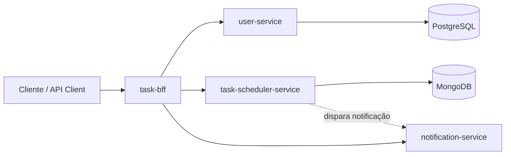
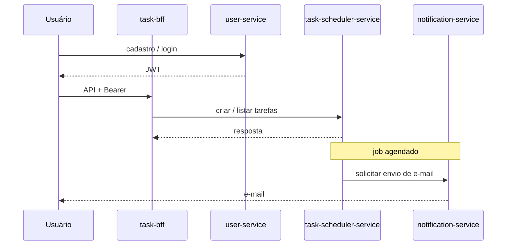

# Task Scheduler System

[](https://github.com/theusazevedd/Task-Scheduler-System/commits/main)
[](https://openjdk.org/)
[](https://spring.io/projects/spring-boot)
[](https://docs.docker.com/compose/)

[](https://www.postgresql.org/)
[](https://www.mongodb.com/)
[](https://jwt.io/)
[](https://spring.io/projects/spring-cloud-openfeign)

Sistema de agendamento de tarefas em arquitetura de microserviços, com **Spring Boot**, comunicação **OpenFeign**, autenticação **JWT** e orquestração **Docker Compose**.

> Repositório de visão geral do ecossistema. Os códigos dos microserviços ficam nos repositórios listados abaixo; use o `docker-compose.yml` da raiz quando as quatro pastas de serviço estiverem presentes.

## 🔗 Repositórios dos serviços

- https://github.com/theusazevedd/user-service
- https://github.com/theusazevedd/task-scheduler-service
- https://github.com/theusazevedd/notification-service
- https://github.com/theusazevedd/task-bff

---

## Índice

- [Repositórios dos serviços](#repositórios-dos-serviços)
- [Visão geral](#visão-geral)
- [Arquitetura](#arquitetura)
- [Fluxo do sistema](#fluxo-do-sistema)
- [Tecnologias](#tecnologias)
- [Como executar com Docker](#como-executar-com-docker)
- [Serviços disponíveis](#serviços-disponíveis)
- [Autenticação](#autenticação)
- [Comunicação entre serviços](#comunicação-entre-serviços)
- [Estrutura do projeto](#estrutura-do-projeto)
- [Variáveis de ambiente](#variáveis-de-ambiente)
- [Desafios e aprendizados](#desafios-e-aprendizados)
- [Observações](#observações)
- [Autor](#autor)

---

## Visão geral

O sistema permite que usuários:

- se cadastrem e autentiquem;
- criem tarefas com data e hora;
- recebam notificações automáticas por e-mail.

A aplicação é distribuída em microserviços independentes, favorecendo escalabilidade e separação de responsabilidades.

---

## Arquitetura

### Componentes

| Componente | Papel |
|------------|--------|
| **task-bff** | Orquestrador (Backend-for-Frontend) |
| **user-service** | Usuários e autenticação |
| **task-scheduler-service** | Tarefas e agendamento |
| **notification-service** | Envio de e-mails |
| **PostgreSQL** | Persistência de usuários |
| **MongoDB** | Persistência de tarefas |

### Diagrama (visão lógica)



---

## Fluxo do sistema

1. Usuário se cadastra (**user-service**).
2. Usuário faz login e recebe **JWT**.
3. O **BFF** recebe requisições autenticadas.
4. O **BFF** encaminha ao **scheduler** quando necessário.
5. O **scheduler** persiste a tarefa no **MongoDB**.
6. Um processo agendado verifica tarefas pendentes.
7. O **notification-service** envia o e-mail.

Fluxo resumido:



---

## Tecnologias

- Java 17  
- Spring Boot  
- Spring Cloud OpenFeign  
- Spring Security + JWT  
- PostgreSQL  
- MongoDB  
- Docker e Docker Compose  
- Gradle ou Maven (conforme cada repositório)

---

## Como executar com Docker

### Pré-requisitos

- [Docker](https://docs.docker.com/get-docker/)
- [Docker Compose](https://docs.docker.com/compose/install/)

### 1. Organizar os repositórios

Na **raiz deste repositório** (ao lado do `docker-compose.yml`), mantenha as pastas dos quatro serviços — cada uma com o respectivo clone:

```text
Task-Scheduler-System/
├── README.md
├── docker-compose.yml
├── .env.example
├── task-bff/
├── user-service/
├── task-scheduler-service/
└── notification-service/
```

Exemplo de clones:

```bash
git clone https://github.com/theusazevedd/Task-Scheduler-System.git
cd Task-Scheduler-System

git clone https://github.com/theusazevedd/task-bff.git
git clone https://github.com/theusazevedd/user-service.git
git clone https://github.com/theusazevedd/task-scheduler-service.git
git clone https://github.com/theusazevedd/notification-service.git
```

> **Importante:** os nomes das pastas devem coincidir com os `context:` do `docker-compose.yml` (`./task-bff`, `./user-service`, etc.). Se o `Dockerfile` ou as variáveis de ambiente dos serviços forem diferentes, alinhe o `docker-compose.yml` e o `.env` com o `application.yml` de cada projeto.

### 2. Variáveis de ambiente

```bash
copy .env.example .env
```

Edite o `.env` com credenciais reais. O arquivo `.env` está no `.gitignore` e **não** deve ser versionado.

### 3. Subir o sistema

```bash
docker compose up --build
```

---

## Serviços disponíveis

| Serviço | URL local |
|---------|-----------|
| **BFF** | http://localhost:8083 |
| **Swagger (BFF)** | http://localhost:8083/swagger-ui/index.html |
| **User Service** | http://localhost:8080 |
| **Task Scheduler** | http://localhost:8081 |
| **Notification** | http://localhost:8082 |

*(Portas assumidas pelo compose de referência; confira cada serviço se houver divergência.)*

---

## Autenticação

O sistema usa **JWT** no header `Authorization`:

```http
Authorization: Bearer <token>
```

Fluxo típico:

1. `POST /usuario/login` no **user-service** (ajuste o path se a sua API divergir) → resposta com **token**.
2. Chamadas ao **BFF** com o token no header acima.

---

## Comunicação entre serviços

Os serviços se comunicam por **HTTP** com **OpenFeign**.

### Dentro do Docker

Use o **nome do serviço** da rede Compose como host (resolução DNS interna):

| Destino | URL base (exemplo) |
|---------|---------------------|
| user-service | `http://user-service:8080` |
| task-scheduler-service | `http://task-scheduler-service:8081` |
| notification-service | `http://notification-service:8082` |

**Não** use `localhost` entre containers para chamar outro serviço; `localhost` dentro do container é o próprio container.

---

## Estrutura do projeto

```text
task-scheduler-system/
├── task-bff/
├── user-service/
├── task-scheduler-service/
├── notification-service/
├── docker-compose.yml
├── .env.example
└── README.md
```

---

## Variáveis de ambiente

Documentação mínima — veja também `.env.example`:

| Variável | Uso típico |
|----------|------------|
| `DB_USER` / `DB_PASSWORD` | PostgreSQL |
| `POSTGRES_DB` | Nome do banco (compose de referência) |
| `EMAIL_USERNAME` / `EMAIL_PASSWORD` | SMTP / notification-service |

Para Gmail, prefira **senha de app**, não a senha da conta.

---

## Desafios e aprendizados

- Comunicação entre containers sem confundir `localhost` com o host da máquina.
- Dois bancos (PostgreSQL + MongoDB) com responsabilidades distintas.
- Orquestração com Docker Compose (dependências, healthchecks, redes).
- Autenticação distribuída com JWT (propagação e validação no BFF/serviços).
- Integração entre microserviços com Feign (timeouts, erros, contratos de API).

---

## Observações

- O **BFF** centraliza a comunicação e simplifica o cliente.
- O **notification-service** costuma ser uma camada fina de envio.
- O **scheduler** concentra a lógica de agendamento e persistência de tarefas.

---

## Autor

Desenvolvido por **Matheus Azevedo**.
